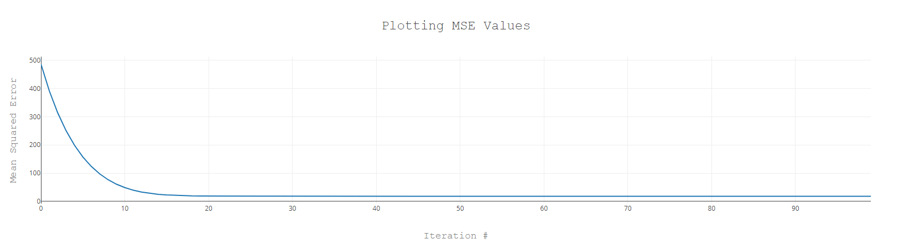

# Gas Mileage Calculator

A gradient descent algorithm using Tensorflow.js.

        

### Features

- loading CSV data and creating a LinearRegression class.
- creating a basic gradient descent implementation with arrays of data and for loops.
- calculating mean squared error (MSE) slopes, updating coefficients and interpreting results.
- understanding matrix multiplication.
- vectorizing the gradient descent algorithm with Tensorflow.js helpers.
- gauging model accuracy by implementing the coefficient of determination.
- applying standardization and massaging learning rates.
- refactoring for multivariate regression.
- tracking MSE history to update learning rate automatically.
- plotting MSE history with nodeplotlib.
- refactoring towards batch and stochastic gradient descent for better performances.
- making predictions with the model.

Based on [Machine Learning with JavaScript](https://www.udemy.com/course/machine-learning-with-javascript/) by Stephen Grider (2020).
