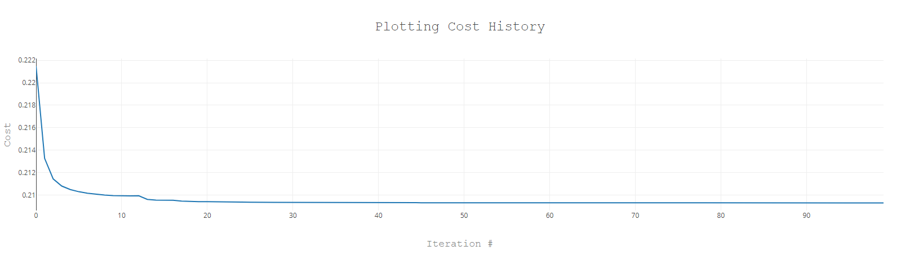

# Smog Test

A gradient descent algorithm in logistic regression to handle binary classification.

        

### Features

- updating linear regression for logistic regression by adding the sigmoid equation.
- implementing a test function to gauge classification accuracy.
- supporting variable decision boundaries.
- refactoring with cross entropy to update learning rate.
- plotting cost history with nodeplotlib.

Based on [Machine Learning with JavaScript](https://www.udemy.com/course/machine-learning-with-javascript/) by Stephen Grider (2020).
