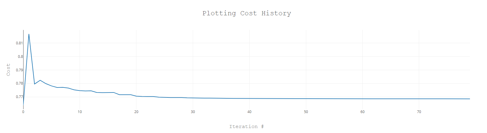

# Handwriting Recognition

Another multinominal logistic regression with a larger dataset.

        

### Features

- flattening image data from MNIST handwritten digit database.
- encoding label values and implementing an accuracy gauge.
- debugging the calculation process with node --inspect-brk.
- dealing with zero variances.
- creating memory snapshots with Chrome debugger.
- releasing references to MNIST dataset.
- optimizing Tensorflow.js memory usage with tf.tidy().
- measuring footprint reduction.
- plotting cost history and improving model accuracy.

Based on [Machine Learning with JavaScript](https://www.udemy.com/course/machine-learning-with-javascript/) by Stephen Grider (2021).
