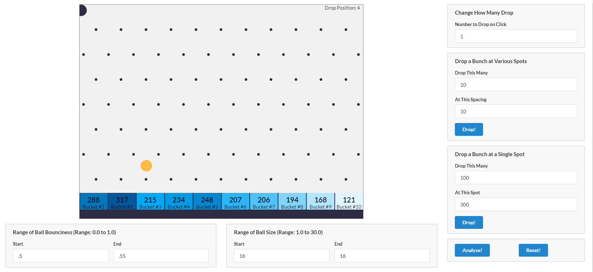

# Machine Learning Projects with JavaScript

This repo is made of 3 projects:

1. [**Plinko**](#plinko): A quick introduction to K-Nearest Neighbors (KNN) algorithm using Lodash.
2. [**House Pricings**](#housepricings): Another implementation of K-Nearest Neighbors (KNN) algorithm with Tensorflow.js.
3. [**Gas Mileage Calculator**](#gasmileage): A gradient descent algorithm in linear regression using Tensorflow.js.
4. [**Smog Test**](#smogtest): A gradient descent algorithm in logistic regression to handle binary classification.
5. [**Fuel Efficiency**](#fuelefficiency): A multinominal logistic regression to handle multi-value classification.

##  1) Plinko

A quick introduction to K-Nearest Neighbors (KNN) algorithm using Lodash.

[See 01-plinko folder](https://github.com/solygambas/javascript-machine-learning/tree/main/01-plinko)

    

### Features

- implementing K-Nearest Neighbors (KNN) algorithm with Lodash methods.
- testing the algorithm and interpreting bad results.
- creating random test and training datasets.
- generalizing KNN, gauging accuracy and printing a report.
- investigating optimal k values.
- updating KNN for multiple features.
- applying normalization with MinMax.
- handling objective feature selection with KNN.

##  2) House Pricings

Another implementation of K-Nearest Neighbors (KNN) algorithm with Tensorflow.js.

[See 02-house-pricings folder](https://github.com/solygambas/javascript-machine-learning/tree/main/02-house-pricings)

### Features

- loading CSV data.
- running K-Nearest Neighbors (KNN) algorithm with Tensorflow.js.
- analyzing results and reporting error percentages.
- applying standardization.
- debugging calculations with node --inspect-brk and Chrome debugger.
- adding features to get a better accuracy.

##  3) Gas Mileage Calculator

A gradient descent algorithm in linear regression using Tensorflow.js.

[See 03-gas-mileage-calculator folder](https://github.com/solygambas/javascript-machine-learning/tree/main/03-gas-mileage-calculator)

    

### Features

- loading CSV data and creating a LinearRegression class.
- creating a basic gradient descent implementation with arrays of data and for loops.
- calculating mean squared error (MSE) slopes, updating coefficients and interpreting results.
- understanding matrix multiplication.
- vectorizing the gradient descent algorithm with Tensorflow.js helpers.
- gauging model accuracy by implementing the coefficient of determination.
- applying standardization and massaging learning rates.
- refactoring for multivariate regression.
- tracking MSE history to update learning rate automatically.
- plotting MSE history with nodeplotlib.
- refactoring towards batch and stochastic gradient descent for better performances.
- making predictions with the model.

##  4) Smog Test

A gradient descent algorithm in logistic regression to handle binary classification.

[See 04-smog-test folder](https://github.com/solygambas/javascript-machine-learning/tree/main/04-smog-test)

    

### Features

- updating linear regression for logistic regression by adding the sigmoid equation.
- implementing a test function to gauge classification accuracy.
- supporting variable decision boundaries.
- refactoring with cross entropy to update learning rate.
- plotting cost history with nodeplotlib.

##  5) Fuel efficiency

A multinominal logistic regression to handle multi-value classification.

[See 05-fuel-efficiency folder](https://github.com/solygambas/javascript-machine-learning/tree/main/05-fuel-efficiency)

<!-- 

    

 -->

### Features

- refactoring to multi-column weights.

Based on [Machine Learning with JavaScript](https://www.udemy.com/course/machine-learning-with-javascript/) by Stephen Grider (2020).
